# Binary to Image

## 什么是Binary-to-image

**Binary-to-image (B2I)** 可以理解为一个集成了多个工具的工作流，旨在帮助开发者和运维人员在项目打包成 War、Jar、Binary 这一类制品后，快速将制品打包成 Docker 镜像，发布到 DockerHub 或 Harbor 等镜像仓库中。同时 B2I 也支持以**创建服务**的形式，一键将制品生成镜像推送到镜像仓库后，创建其部署 (Deployment) 和服务 (Service) 并自动发布到 Kubernetes 集群中。

在 B2I 工作流中，您不需要编写 Dockerfile。这不仅能降低学习成本，也能提升发布效率，使您更加专注于业务。

## 使用 Binary-to-Image (B2I) 

接下来用两个示例介绍 B2I 的两种使用方式。

- **使用 Binary-to-Image (B2I) 创建服务**
- **使用 Image Builder 构建镜像**

> **以下提供 5 个供测试使用的制品包，您也可以提交个人打包的测试项目到 KubeSphere** [社区](https://github.com/kubesphere/tutorial)**。**

| 示例包                                                       | 示例项目（代码仓库）                                         |
| :----------------------------------------------------------- | :----------------------------------------------------------- |
| [b2i-war-java8.war](https://github.com/kubesphere/tutorial/raw/master/tutorial 4 - s2i-b2i/b2i-war-java8.war) | [Spring-MVC-Showcase](https://github.com/spring-projects/spring-mvc-showcase) |
| [b2i-war-java11.war](https://github.com/kubesphere/tutorial/raw/master/tutorial 4 - s2i-b2i/b2i-war-java11.war) | [SpringMVC5](https://github.com/kubesphere/s2i-java-container/tree/master/tomcat/examples/springmvc5) |
| [b2i-binary](https://github.com/kubesphere/tutorial/raw/master/tutorial 4 - s2i-b2i/b2i-binary) | [DevOps-go-sample](https://github.com/runzexia/devops-go-sample) |
| [b2i-jar-java11.jar](https://github.com/kubesphere/tutorial/raw/master/tutorial 4 - s2i-b2i/b2i-jar-java11.jar) | [java-maven-example](https://github.com/kubesphere/s2i-java-container/tree/master/java/examples/maven) |
| [b2i-jar-java8.jar](https://github.com/kubesphere/tutorial/raw/master/tutorial 4 - s2i-b2i/b2i-jar-java8.jar) | [devops-java-sample](https://github.com/kubesphere/devops-java-sample) |

### 准备工作

- 您需要启用 [KubeSphere DevOps 系统](https://kubesphere.com.cn/docs/pluggable-components/devops/)。
- 您需要创建一个 [Docker Hub](http://www.dockerhub.com/) 帐户，也支持 GitLab 和 Harbor。
- 您需要创建一个企业空间、一个项目和一个用户 (`project-regular`)，请务必邀请该用户至项目中并赋予 `operator` 角色。有关更多信息，请参见[创建企业空间、项目、用户和角色](https://kubesphere.com.cn/docs/quick-start/create-workspace-and-project/)。
- （可选）设置一个 CI 专用节点用于构建镜像。该操作不是必需，但建议开发和生产环境进行设置，专用节点会缓存依赖项并缩短构建时间。有关更多信息，请参见[为缓存依赖项设置 CI 节点](https://kubesphere.com.cn/docs/devops-user-guide/how-to-use/set-ci-node/)。

### 使用 Binary-to-Image (B2I) 创建服务

下图中的步骤展示了如何在 B2I 工作流中通过创建服务来上传制品、构建镜像并将其发布至 Kubernetes。

> - ① 在 KubeSphere 创建 B2I 类型的服务，上传制品或二进制包
> - ② B2I 将在后台创建 K8s Job、Deployment 和 Service
> - ③ 将制品自动打包成 Docker 镜像
> - ④ 推送镜像至 DockerHub 或 Harbor
> - ⑤ B2I Job 将在第二步创建的 Deloyment 中使用仓库中的镜像
> - ⑥ 自动发布至 Kubernetes
>
> **说明：在上述流程中，B2I Job 还会在后台执行状态上报的功能**

#### 步骤1：创建Docker Hub保密字典

您必须创建 Docker Hub 保密字典，以便将通过 B2I 创建的 Docker 镜像推送至 Docker Hub。以 `project-regular` 身份登录 KubeSphere，转到您的项目并创建一个 Docker Hub 保密字典。有关更多信息，请参见[创建常用保密字典](https://kubesphere.com.cn/docs/project-user-guide/configuration/secrets/#创建常用保密字典)。

#### 步骤2：创建服务

1. 在该项目中，转到**应用负载**下的**服务**，点击**创建**。

   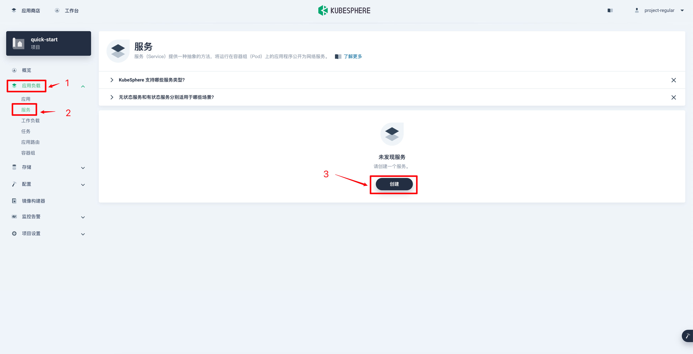

2. 下拉至**通过制品构建服务**，选择 **WAR**。本教程使用 [SpringMVC5](https://github.com/kubesphere/s2i-java-container/tree/master/tomcat/examples/springmvc5) 项目作为示例并上传 WAR 制品至 KubeSphere。设置一个名称，例如 `b2i-war-java11`，点击**下一步**

   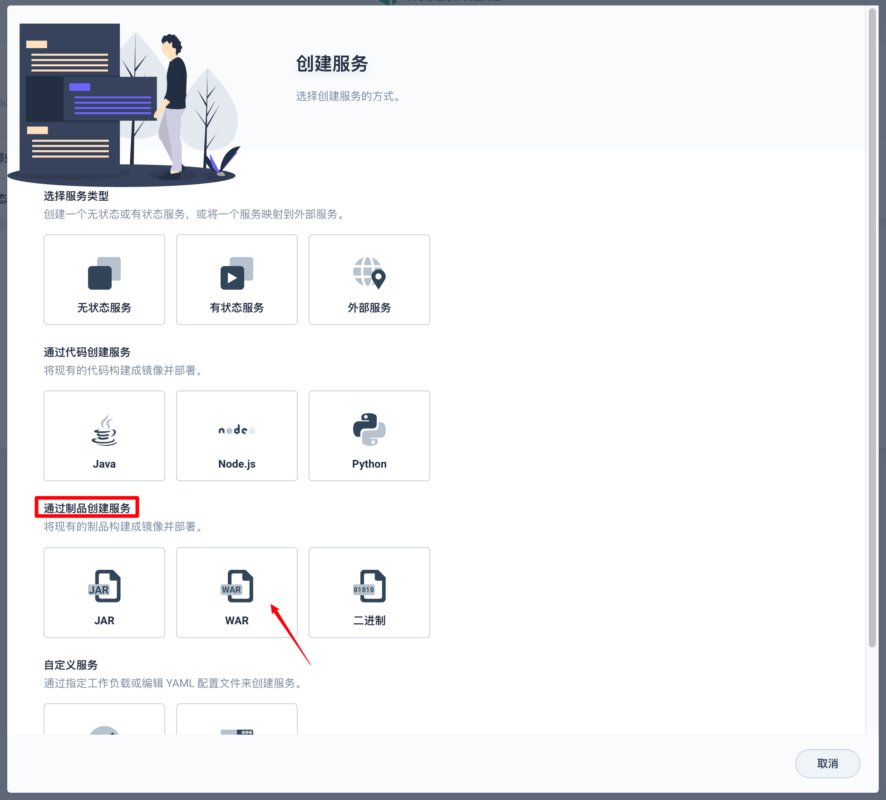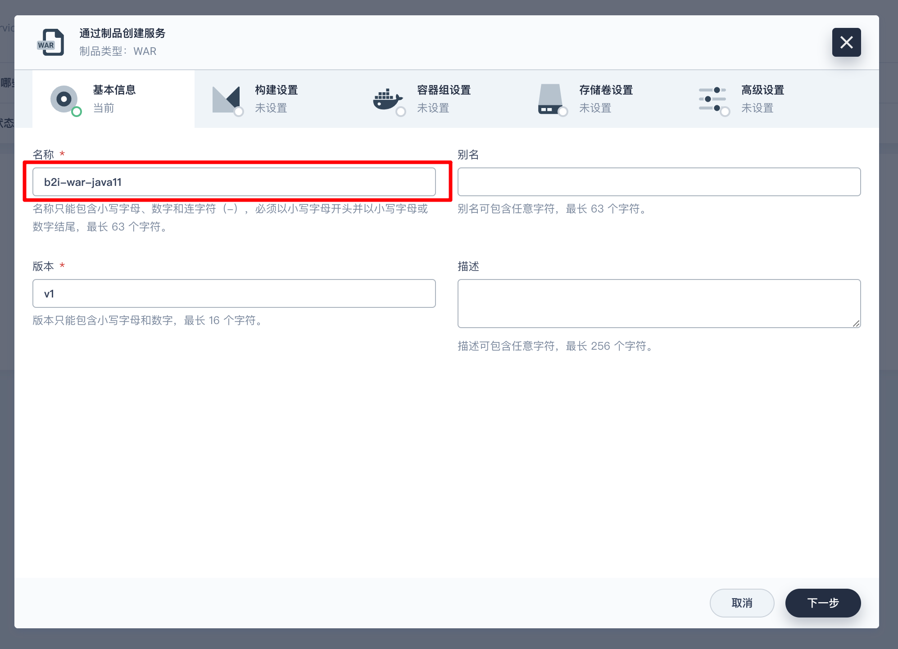

3. 在**构建设置**页面，请提供以下相应信息，并点击**下一步**。

   **服务类型**：本示例选择**无状态服务**。有关不同服务的更多信息，请参见[服务类型](https://kubesphere.com.cn/docs/project-user-guide/application-workloads/services/#服务类型)。

   **制品文件**：上传 WAR 制品 ([b2i-war-java11](https://github.com/kubesphere/tutorial/raw/master/tutorial%204%20-%20s2i-b2i/b2i-war-java11.war))。

   **构建环境**：选择 **kubesphere/tomcat85-java11-centos7:v3.2.0**。

   **镜像名称**：输入 `<DOCKERHUB_USERNAME>/<IMAGE NAME>` 或 `<HARBOR-PROJECT_NAME>/<IMAGE NAME>` 作为镜像名称。

   **镜像标签**：镜像标签，请输入 `latest`。

   **目标镜像仓库**：镜像会推送至 Docker Hub，故请选择 Docker Hub 保密字典。

   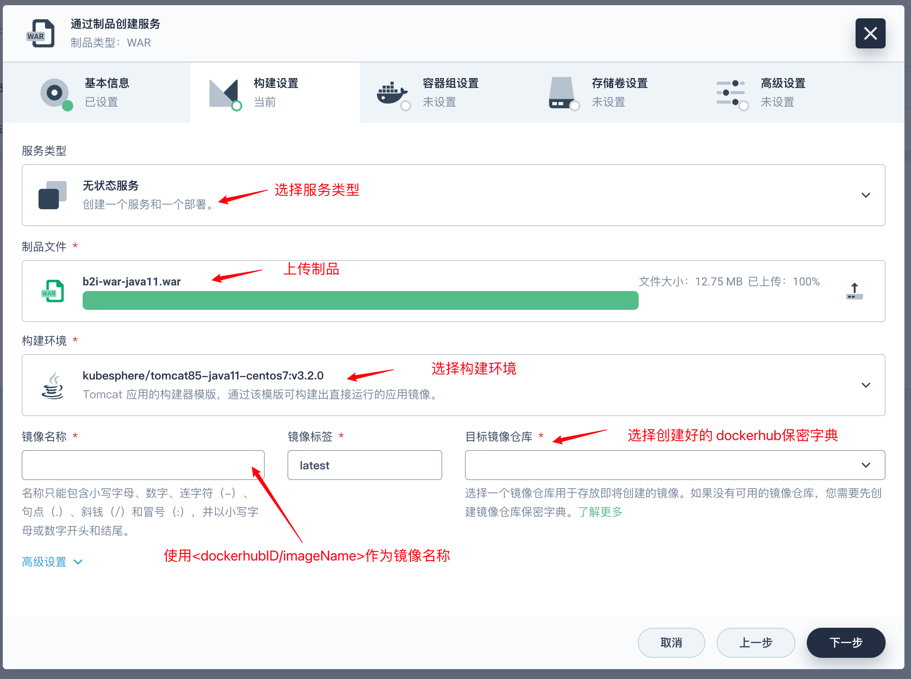

4. 在**容器组设置**页面，下拉至**端口设置**，为容器设置访问策略。**协议**选择 **HTTP**，自定义名称（例如 `http-port`），**容器端口**和**服务端口**都输入 `8080`。点击**下一步**继续。

   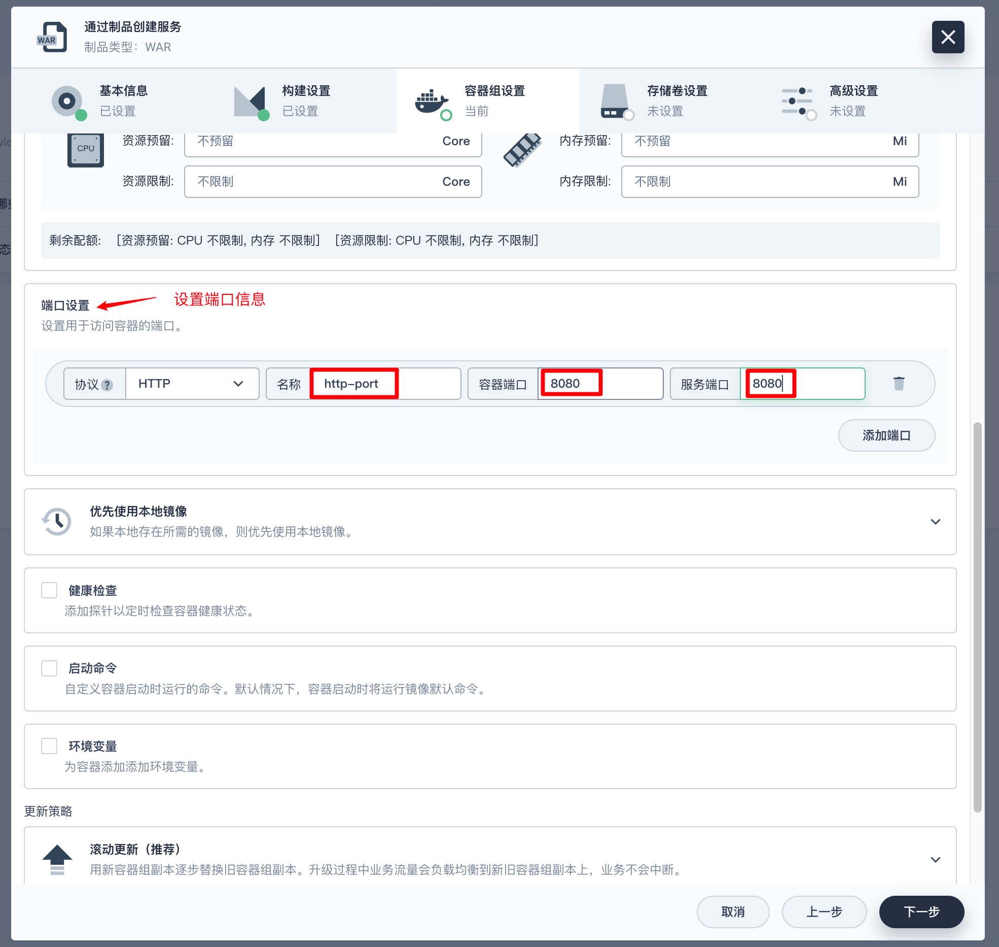

   > **备注**
   >
   > 有关如何在**容器设置**页面设置其他参数的更多信息，请参见[容器组设置](https://kubesphere.com.cn/docs/project-user-guide/application-workloads/container-image-settings/)。

5. 在**存储卷设置**页面，您可以为容器添加存储卷。有关更多信息，请参见[存储卷](https://kubesphere.com.cn/docs/project-user-guide/storage/volumes/)。

6. 在**高级设置**页面，选中**外部访问**并选择 **NodePort** 作为访问方式。点击**创建**完成整个操作过程。

   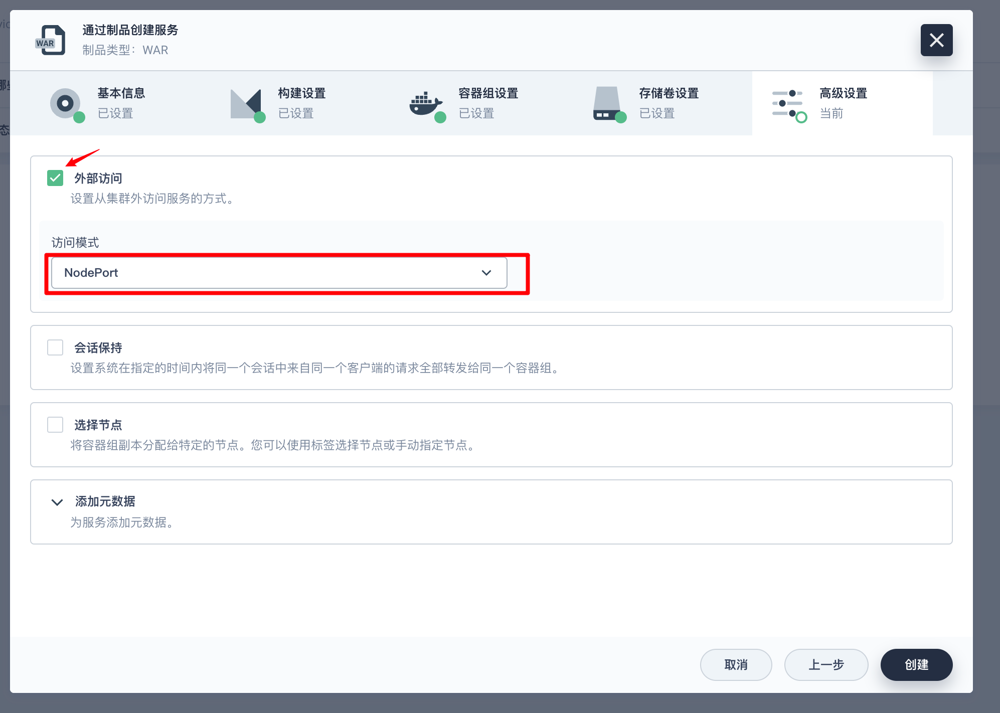

7. 点击左侧导航栏的**镜像构建器**，您可以看到正在构建示例镜像。

   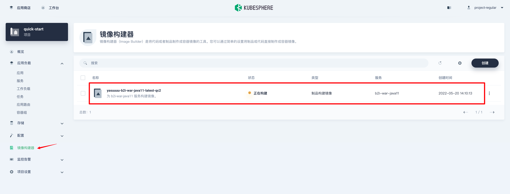

#### 步骤3：查看结果

1. 稍等片刻，您可以看到镜像构建器状态变为**成功**。

   

2. 点击该镜像前往其详情页面。在**任务记录**下，点击记录右侧的  查看构建日志。如果一切运行正常，您可以在日志末尾看到 `Build completed successfully`。

3. 回到**服务**、**部署**和**任务**页面，您可以看到该镜像相应的服务、部署和任务都已成功创建。

   

4. 在您的 Docker Hub 仓库，您可以看到 KubeSphere 已经向仓库推送了带有预期标签的镜像。

   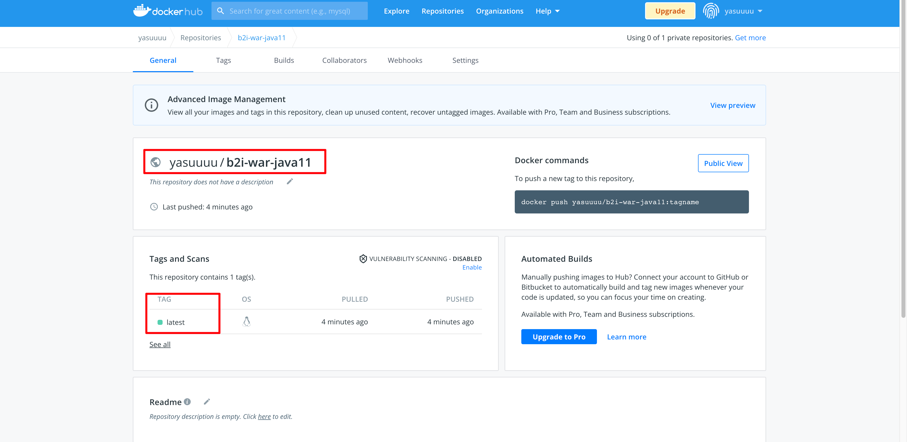

#### 步骤4：访问服务

1. 在**服务**页面，请点击 B2I 服务前往其详情页面，您可以查看暴露的端口号。

   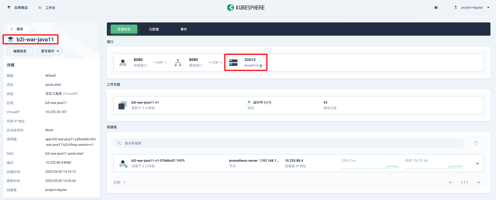

2. 通过 `http://<Node IP>:<NodePort>/<Binary-Package-Name>/` 访问服务。

   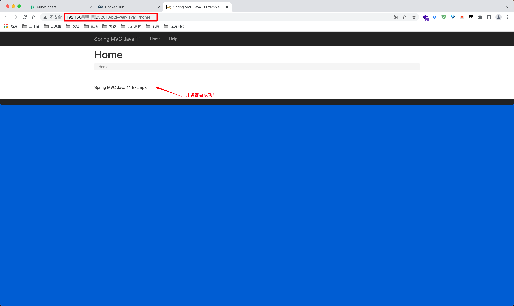

   > **备注**
   >
   > 取决于您的部署环境，您可能需要在安全组中放行端口并配置端口转发规则。

### 使用 Image Builder 构建镜像

前述示例通过**创建服务**来实现整个 B2I 工作流。除此之外，您也可以直接使用**镜像构建器**基于制品构建镜像。

与第一种方式不同，本方式**不会将镜像发布至 Kubernetes**。

> **备注**
>
> 请确保您已经创建了 Docker Hub 保密字典。有关更多信息，请参见[创建常用保密字典](https://kubesphere.com.cn/docs/project-user-guide/configuration/secrets/#创建常用保密字典)。

#### 步骤1：上传制品

1. 以 `project-regular` 身份登录 KubeSphere，转到您的项目。

2. 在左侧导航栏中选择**镜像构建器**，然后点击**创建**。

   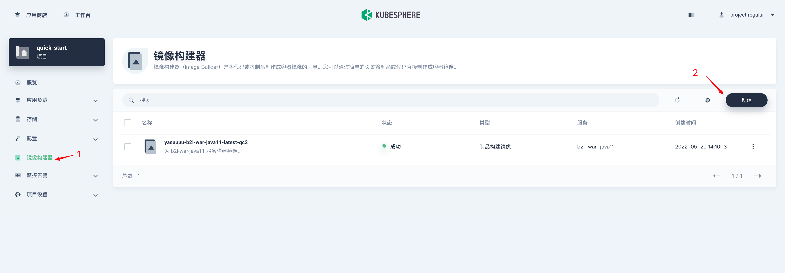

3. 在弹出的对话框中，选择 **二进制** 并点击**下一步**。

   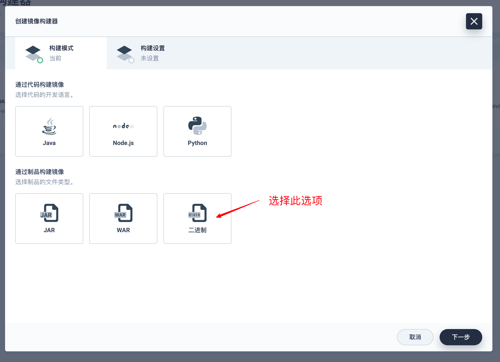

4. 在**构建设置**页面，请提供以下相应信息，然后点击**创建**。

   **上传制品**：下载 [b2i-binary](https://github.com/kubesphere/tutorial/raw/master/tutorial 4 - s2i-b2i/b2i-binary) 并上传至 KubeSphere。

   **构建环境**：选择 **kubesphere/s2i-binary:v3.2.0**。

   **镜像名称**：自定义镜像名称。

   **镜像标签**：镜像标签，请输入 `latest`。

   **目标镜像仓库**：镜像会推送至 Docker Hub，故请选择 Docker Hub 保密字典。

   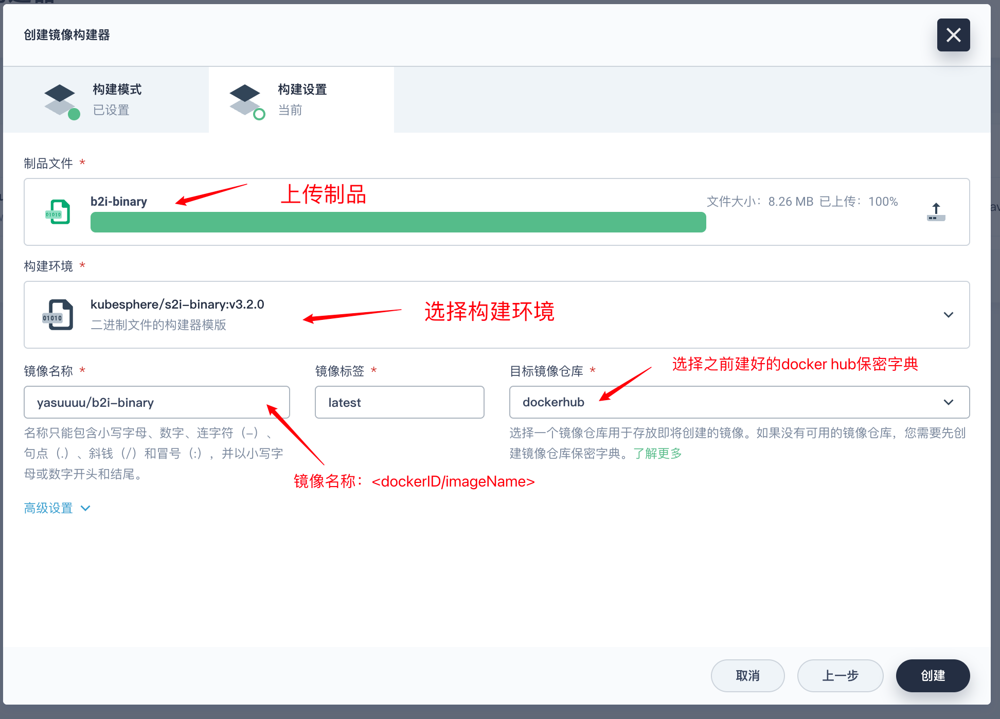

   

5. 在**镜像构建器**页面，您可以看到正在构建镜像。

   

#### 步骤2：检查结果

1. 稍等片刻，您可以看到镜像构建器状态变为**成功**。

   

2. 点击该镜像构建器前往其详情页面。在**任务记录**下，点击记录右侧的  查看构建日志。如果一切运行正常，您可以在日志末尾看到 `Build completed successfully`。

3. 前往**任务**页面，您可以看到该镜像相应的任务已成功创建。

   

4. 在您的 Docker Hub 仓库，您可以看到 KubeSphere 已经向仓库推送了带有预期标签的镜像。

   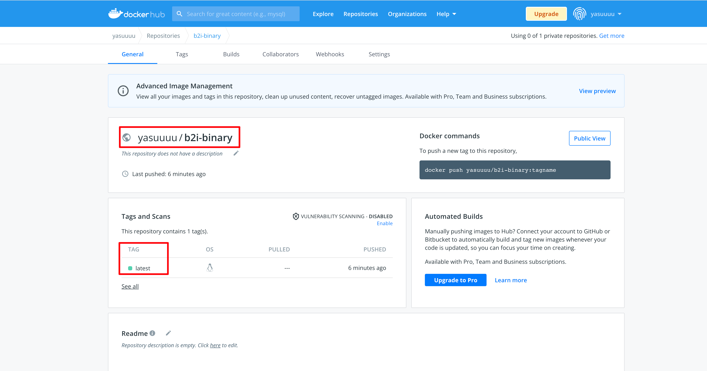

